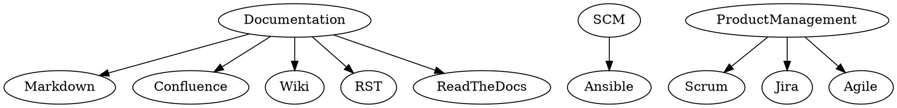

[](/images/my-skills.png)

Я долго искал подходящий инструмент для визуализации сложносвязанных сущностей. Например, для фана захотелось дерево навыков в резюме засунуть (потом я от этого отказался, конечно, но фан был). Сперва я попробовал работать с **GraphML** и **Gephi**. Не понравилось, потому что: сложно, долго, всё основано на GUI, результат выглядел страшно. Через час мучений я прислушался к [@Shoonoise](https://twitter.com/shoonoise/status/798232697265156096) и попробовал dot. И это оказался весьма человекоориентированный язык! Вот пример:



Никаких:

``` xml
<node id="1" label="SCM"/>
<edge source="1" target="2"/>
```

Просто человеческий текст!

``` shell
pip install graphviz
```

Спустя два часа у меня получились вот такие картинки ([SVG](/images/my-skills.svg)) ([PNG](/images/my-skills.png)) из [DOT (исходник)](/share/my-skills.gv). Делал их с помощью такого кода:

``` shell
sfdp -Goverlap=prism  share/my-skills.gv | gvmap -e | neato -Ecolor="#55555522" -n2 -Tsvg > images/my-skills.svg
sfdp -Goverlap=prism  share/my-skills.gv | gvmap -e | neato -Ecolor="#55555522" -n2 -Tpng > images/my-skills.png
```

## Проблемы на MacOS

### 'Overlap value "prism" unsupported - ignored'

``` shell
$ brew install graphviz
$ sfdp -Goverlap=prism x.dot | gvmap -e | neato -Ecolor=#55555522 -n2 -Tpng > x.png
Warning: Overlap value "prism" unsupported - ignored
Error: remove_overlap: Graphviz not built with triangulation library
Error: get_triangles: Graphviz built without any triangulation library

Assertion failed: (m > 0 && n > 0 && nz >= 0), function SparseMatrix_from_coordinate_arrays_internal, file SparseMatrix.c, line 843.
```

Решение: нужно пересобирать graphviz из исходников. Правильнее было бы сделать так:


``` shell
brew install graphviz --with-gts
```

но когда я это делал - graphviz переезжал на gitlab, из-за этого ничего не получалось. Обошёл так:

``` shell
brew install gts
git clone https://gitlab.com/graphviz/graphviz.git
cd graphviz
./autogen.sh
./configure --with-gts
make -j 4
sudo make install
```
